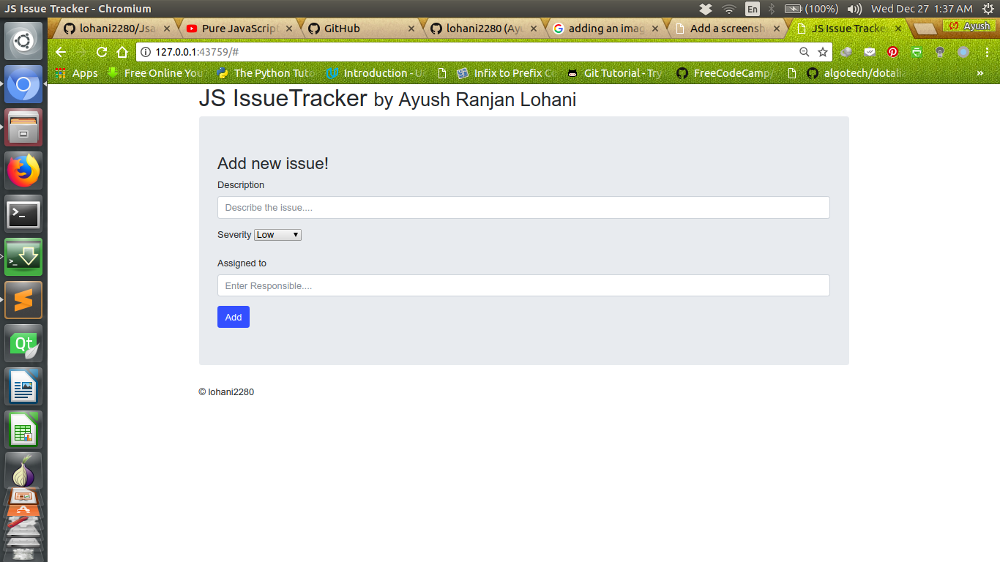
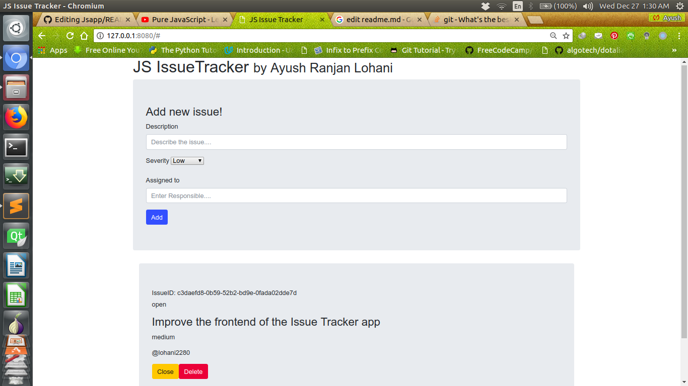
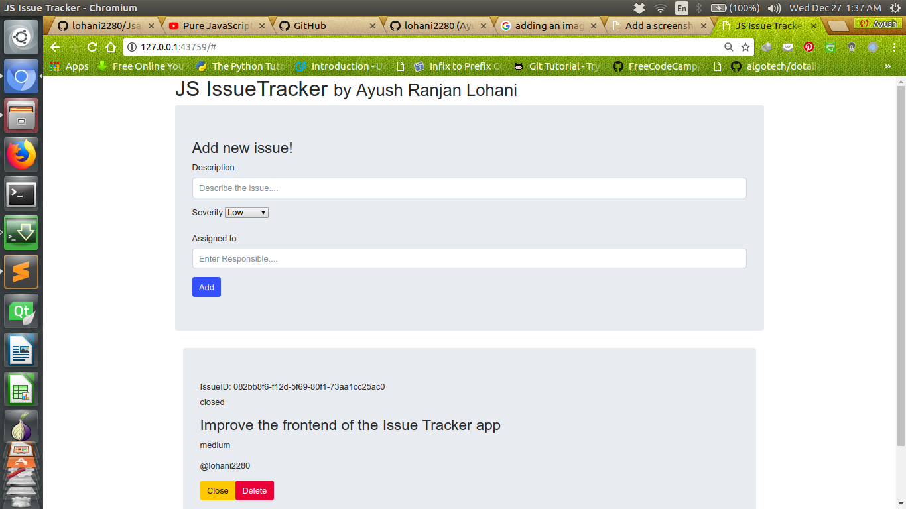

# Issue_Tracker
It's a very simple issue tracker where one can describe an issue regarding any software product 
using the input form here.It uses the HTML5 local storage to store data on user's browser.
# Features
1. One can open a new issue by filling the input form and clicking the `Add` Button.
2. One can close an issue using the `Close` Button and then status of the issue will be set to `close`
3. One can delete an issue using the `Delete` Button.

#### Input Form to open an Issue

#### When the issue is in open state

#### When the issue is in closed state

